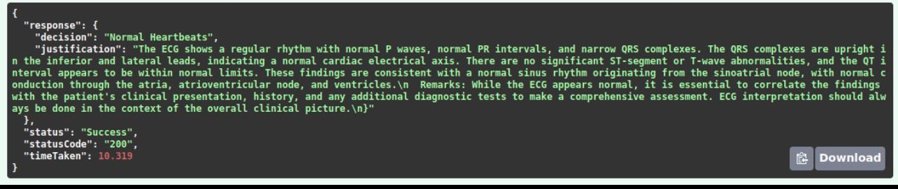
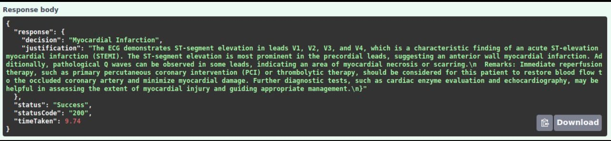
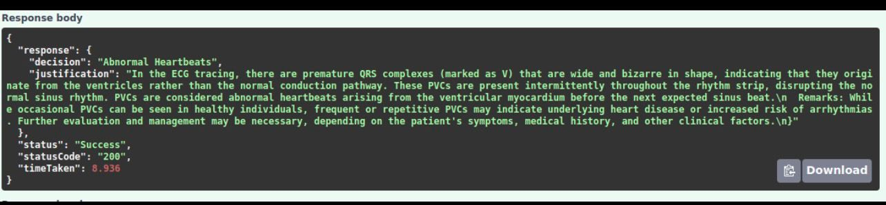

# Electrocardiogram Risk Engine

## Overview

The Electrocardiogram Risk Engine is an advanced machine learning project designed to classify and diagnose ECG images with exceptional accuracy. Leveraging cutting-edge models such as Google's Vision Transformer (ViT) and Anthropic Claude SONNET via Amazon Bedrock, this project aims to enhance heart health diagnostics by providing detailed analysis and insights into various cardiac conditions.

## Problem Statement

Cardiovascular diseases are the leading cause of death in the United States, claiming approximately 697,000 lives annually. Electrocardiograms (ECGs) are critical diagnostic tools used to monitor heart health, detect arrhythmias, and predict potential heart attacks. However, interpreting ECG results remains a complex task requiring specialized medical expertise.

In the U.S., about 1.5 million ECGs are performed daily, yet subtle abnormalities often go unnoticed, leading to missed diagnoses and inadequate patient care. This gap highlights the need for an intelligent solution that leverages machine learning to improve the accuracy and efficiency of ECG interpretations.

The Electrocardiogram Risk Engine addresses this critical issue by providing a robust model capable of analyzing ECG images with 99% accuracy. By automating heart condition detection, this project aims to improve patient outcomes and reduce healthcare costs associated with cardiovascular diseases.

## Key Features

- **High Accuracy:** Achieves 99% accuracy across various classifications, surpassing existing models with a 96% accuracy rate.
- **Data-Driven Insights:** Utilizes ECG data to assist in risk assessment.
- **Advanced Model Architecture:** Employs Vision Transformer (ViT) technology enhanced with additional attention layers for superior performance.
- **Comprehensive Dataset:** Analyzes diverse ECG images, capturing a wide range of heart conditions.

## Project Highlights

- **Integration of Vision Transformer (ViT):** Successfully integrated ViT, fine-tuning it with attention layers to achieve a groundbreaking 99% accuracy in ECG classification.
- **Utilization of Anthropic Claude SONNET Model:** Utilized Anthropic Claude SONNET via Amazon Bedrock to provide detailed decision-making and justification for each ECG diagnosis.
- **Significant Accuracy Improvement:** Improved classification accuracy from 70% to 98% through activation layer enhancements in ViT, outperforming the best existing models.

## Importance of ECGs

- **Preventive Healthcare:** Early detection of heart conditions through ECG can lead to a 15-20% reduction in overall healthcare costs due to preventive measures and early treatment.
- **Accurate Risk Assessment:** ECG data improves the accuracy of risk assessments, detecting asymptomatic heart conditions in up to 5% of individuals who might otherwise be overlooked. Moreover, it also allows for diagnosing ECG without a Headlth Supervisor, thereby reducing the cost of diagnosis.

## How It Works

1. **Data Acquisition:** The engine uses a dataset containing ECG images classified into four categories: normal, abnormal, myocardial infarction, and COVID-19-related abnormalities.
2. **Model Iterations:** The project iterates through various models, including ResNet 50, MobilNet, and ViT, to identify the most accurate and efficient approach. 
3. **Classification and Analysis:** The Vision Transformer (ViT) model analyzes ECG images, providing detailed classification for each diagnosis.
4. **Evaluation:** The result along with the base64 image is then passed to the LLM, in this case Anthropic Claude SONNET, to provide the decision and the justification for each diagnosis.


## Model Outputs





## Getting Started

### Prerequisites

- Python 3.7 or higher
- Git
- Git LFS (for handling large files)
- AWS Bedrock account with access to Anthropic Claude SONNET

### Installation

1. Clone the repository:

   ```bash
   git clone https://github.com/vishalseelam/ElectrocardiogramRiskEngine.git
   ```

2. Install required dependencies:

   ```bash
   pip install -r requirements.txt
   ```

3. Configure your environment variables by creating a `.env` file in the project root directory with the following content:

   ```plaintext
   AWS_ACCESS_KEY_ID=your-access-key-id
   AWS_SECRET_ACCESS_KEY=your-secret-access-key
   AWS_SESSION_TOKEN=your-session-token
   ```

   Make sure to replace the placeholders with your actual AWS credentials to access the Anthropic Claude SONNET model via Amazon Bedrock.

### Usage

1. Prepare your dataset of ECG images.
2. Run the model training script:

   ```bash
   python train_model.py
   ```

3. Evaluate the model:

   ```bash
   python evaluate_model.py
   ```

4. Analyze new ECG images:

   ```bash
   python analyze_ecg.py --image path/to/your/ecg_image.png
   ```

## Challenges and Solutions

- **Data Complexity:** Initial models like CNNs struggled with the complex morphology of ECG signals, leading to a high rate of misclassifications. Switching to ViT improved accuracy significantly.
- **Resource Requirements:** The ViT model requires substantial computational resources for training and inference, highlighting the need for optimized deployment strategies.

## Contributing

We welcome contributions to improve the Electrocardiogram Risk Engine. Please submit issues and pull requests on the GitHub repository.

## License

This project is licensed under the MIT License - see the LICENSE file for details.

## Contact

For more information, please contact:

- Vishal Seelam
- Email: vishalseelam@example.com
- GitHub: [vishalseelam](https://github.com/vishalseelam)


