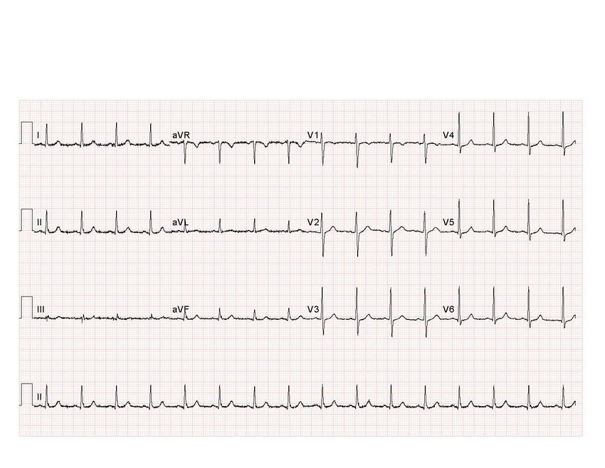
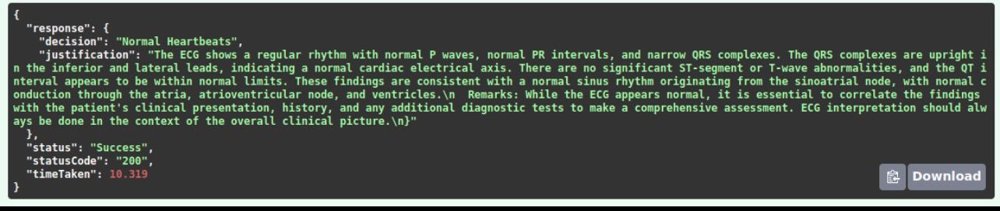
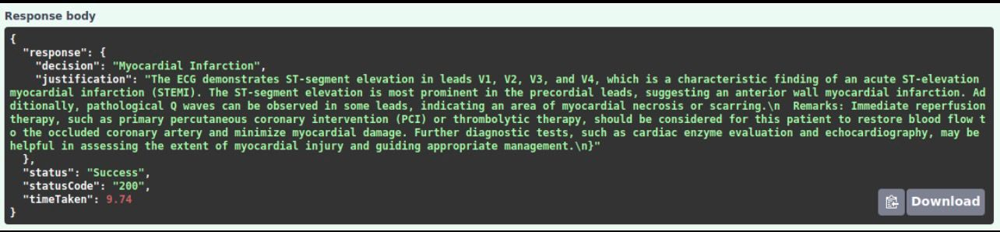
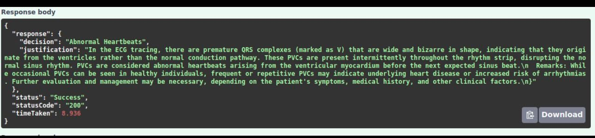

# Electrocardiogram Risk Engine

## Overview

The Electrocardiogram Risk Engine is an advanced machine learning project designed to classify and diagnose ECG images with exceptional accuracy. Leveraging cutting-edge models such as Google's Vision Transformer (ViT) and Anthropic Claude SONNET via Amazon Bedrock, this project aims to enhance heart health diagnostics by providing detailed analysis and insights into various cardiac conditions.

## Problem Statement

Cardiovascular diseases are the leading cause of death in the United States, claiming approximately 697,000 lives annually. Electrocardiograms (ECGs) are critical diagnostic tools used to monitor heart health, detect arrhythmias, and predict potential heart attacks. However, interpreting ECG results remains a complex task requiring specialized medical expertise.

In the U.S., about 1.5 million ECGs are performed daily, yet subtle abnormalities often go unnoticed, leading to missed diagnoses and inadequate patient care. This gap highlights the need for an intelligent solution that leverages machine learning to improve the accuracy and efficiency of ECG interpretations.

The Electrocardiogram Risk Engine addresses this critical issue by providing a robust model capable of analyzing ECG images with 99% accuracy. By automating heart condition detection, this project aims to improve patient outcomes and reduce healthcare costs associated with cardiovascular diseases.

## Key Features

- **High Accuracy:** Achieves 99% accuracy across various classifications, surpassing existing models with a 96% accuracy rate.
- **Data-Driven Insights:** Utilizes ECG data to assist in risk assessment.
- **Advanced Model Architecture:** Employs Vision Transformer (ViT) technology enhanced with additional attention layers for superior performance.
- **Comprehensive Dataset:** Analyzes diverse ECG images, capturing a wide range of heart conditions.
- **Detailed Justification:** Uses Anthropic Claude SONNET to provide detailed explanations of diagnoses.

## Project Structure

```
ElectrocardiogramRiskEngine/
├── assets/                       # Static assets
│   └── images/                   # Images used in documentation and examples
├── config.json                   # Model configuration file
├── main.py                       # Main entry point for the API server
├── model.h5                      # Pre-trained model weights
├── requirements.txt              # Python dependencies
├── LICENSE                       # MIT License file
├── setup.py                      # Package setup file for installation
├── Dockerfile                    # Docker configuration for containerization
├── docker-compose.yml            # Docker Compose configuration
├── .env.template                 # Template for environment variables
├── docs/                         # Documentation files
├── notebooks/                    # Jupyter notebooks
│   └── VIT_ECG.ipynb             # Notebook for model training and development
├── scripts/                      # Utility scripts for testing
│   ├── api_client.py             # Example API client
│   ├── test_llm.py               # Script to test the LLM component
│   └── test_model.py             # Script to test the Vision Transformer model
└── src/                          # Source code
    ├── api/                      # API implementation
    │   └── ecg_api.py            # FastAPI endpoints
    ├── models/                   # Model implementations
    │   ├── llm_model.py          # LLM analyzer model
    │   └── vit_model.py          # Vision Transformer model
    └── utils/                    # Utility functions
        └── helpers.py            # Helper functions
```

## Supported ECG Classifications

The ECG Risk Engine can identify and classify various heart conditions including:

1. **Myocardial Infarction** - Heart attack indications
2. **Abnormal Heartbeats** - Various arrhythmias and abnormal patterns
3. **Normal Heartbeats** - Healthy ECG patterns
4. **History of MI** - Indications of previous heart attacks
5. **COVID-19 Related** - ECG patterns associated with COVID-19 infections

## Model Input Example


## Model Outputs




## Getting Started

### Prerequisites

- Python 3.7 or higher
- Git
- Git LFS (for handling large files)
- AWS Bedrock account with access to Anthropic Claude SONNET

### Installation

1. Clone the repository:

   ```bash
   git clone https://github.com/vishalseelam/ElectrocardiogramRiskEngine.git
   cd ElectrocardiogramRiskEngine
   ```

2. Install required dependencies:

   ```bash
   pip install -r requirements.txt
   ```

3. Configure your environment variables by creating a `.env` file in the project root directory:

   ```bash
   cp .env.template .env
   ```

   Edit the `.env` file and replace the placeholders with your actual AWS credentials to access the Anthropic Claude SONNET model via Amazon Bedrock.

### Usage

#### Running the API Server

Start the API server:

```bash
python main.py
```

The server will start on `http://localhost:8005`. You can access the API documentation at `http://localhost:8005/docs`.

#### Analyzing an ECG Image via API

You can use the provided client script to analyze an ECG image:

```bash
python scripts/api_client.py --image path/to/your/ecg_image.jpg
```

#### Testing the ViT Model Directly

```bash
python scripts/test_model.py --image path/to/your/ecg_image.jpg
```

#### Testing the LLM Analysis

```bash
python scripts/test_llm.py --image path/to/your/ecg_image.jpg
```

## API Endpoints

- **POST /api/analyze**: Upload an ECG image for analysis
- **GET /health**: Check the API health status

## Challenges and Solutions

- **Data Complexity:** Initial models like CNNs struggled with the complex morphology of ECG signals, leading to a high rate of misclassifications. Switching to ViT improved accuracy significantly.
- **Resource Requirements:** The ViT model requires substantial computational resources for training and inference, highlighting the need for optimized deployment strategies.
- **Multi-modal Integration:** Combining the ViT model with the LLM required careful prompt engineering to ensure the LLM could properly interpret and justify the ViT's predictions.

## Future Work

- **Expanded Classifications:** Adding support for additional heart conditions and ECG patterns.
- **Real-time Integration:** Developing capabilities for real-time ECG monitoring and analysis.
- **Mobile Deployment:** Creating lightweight versions of the models for mobile device deployment.
- **Multilingual Support:** Adding support for reports in multiple languages.

## Contributing

We welcome contributions to improve the Electrocardiogram Risk Engine. Please follow these steps:

1. Fork the repository
2. Create a feature branch (`git checkout -b feature/amazing-feature`)
3. Commit your changes (`git commit -m 'Add amazing feature'`)
4. Push to the branch (`git push origin feature/amazing-feature`)
5. Open a Pull Request

## License

This project is licensed under the MIT License - see the LICENSE file for details.

## Contact

For more information, please contact:

- Vishal Seelam
- Email: vishal.seelam@tcu.edu


